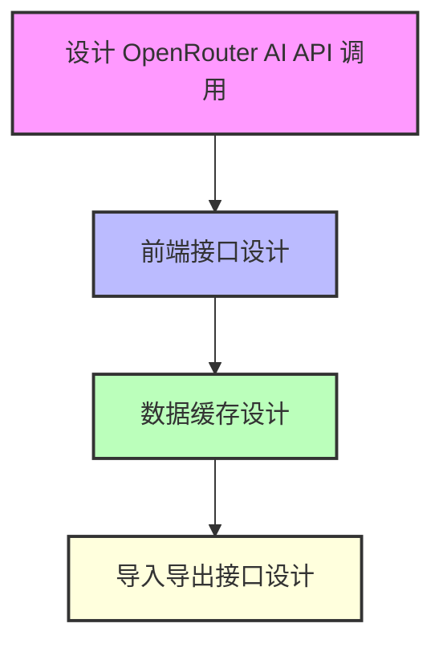
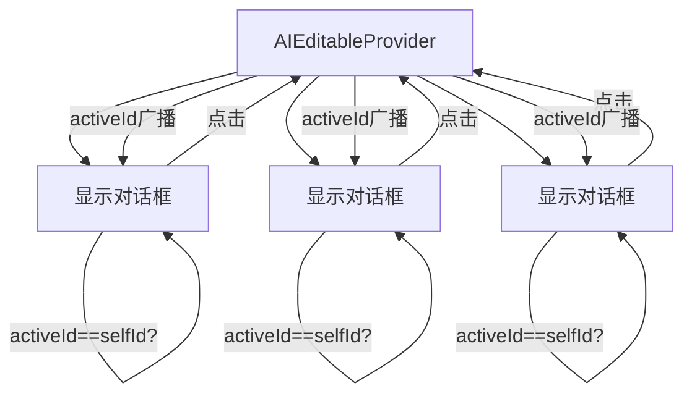
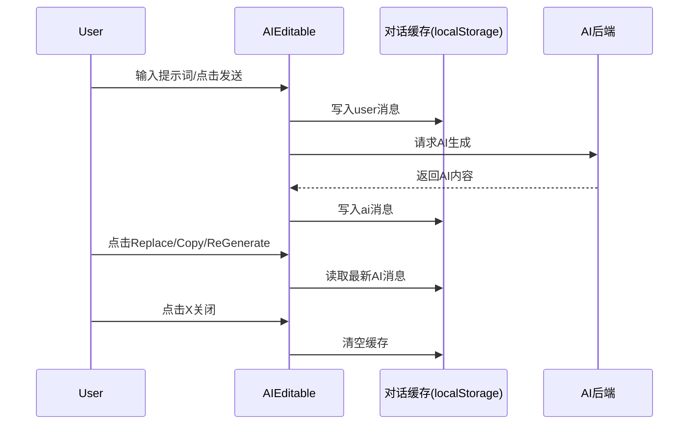
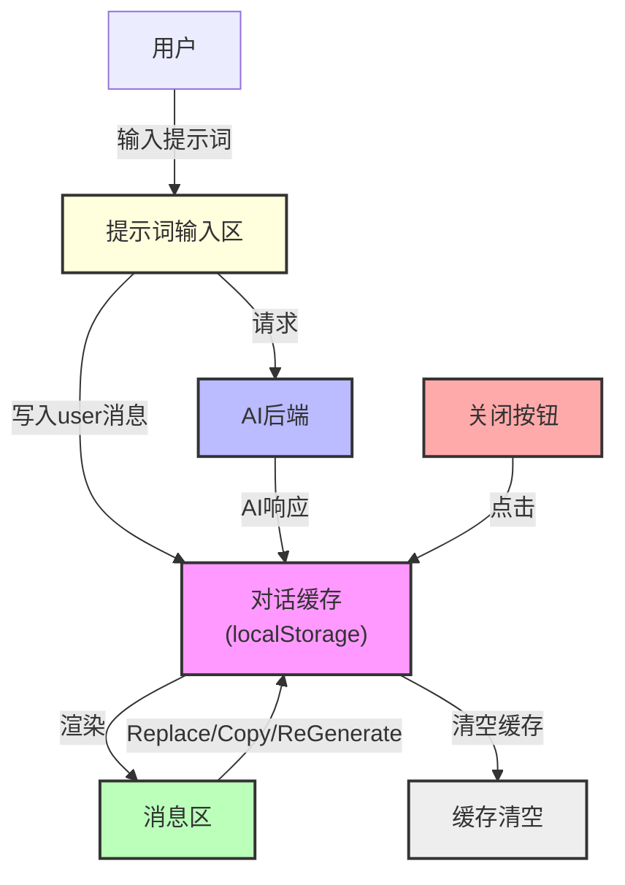

# 报纸编辑与AI生成内容的完整技术方案

## 1. 方案目标
- 支持用户在报纸编辑页面手动编辑或通过AI生成报纸内容。
- 用户编辑结果（包括AI生成内容）实时缓存到浏览器本地（localStorage/sessionStorage）。
- 支持内容的导出（JSON格式，不含图片）与导入（JSON数据直接渲染到页面）。
- 兼容Simple/Modern两种报纸模板，字段映射清晰。
- AI生成内容时可配置生成字符数，避免内容过长或过短影响排版。

---

## 2. 字段设计与模板映射

### 2.1 BaseConfig 字段
BaseConfig 定义了两种模板的初始内容结构：
- **Simple模板字段**：
  - edition, headline, title, mainText, sideTitle, sideDesc, bottomTitle, bottomDesc, footer
- **Modern模板字段**：
  - leftTop, rightTop, headline, subTitle, aboutTitle, aboutText, dateDay, dateMonth, addr1, addr2, addr3, dateTime, joinTitle, joinText

### 2.2 缓存结构设计
- 以模板类型为key，缓存结构如下：
```json
{
  "templateType": "simple" | "modern",
  "content": { ...字段内容... }
}
```
- 示例：
```json
{
  "templateType": "simple",
  "content": {
    "edition": "...",
    "headline": "...",
    ...
  }
}
```

---

## 3. 本地缓存与保存机制

### 3.1 缓存方式
- 使用 `localStorage`（或`sessionStorage`，推荐localStorage）按模板类型分别存储。
- 每次用户编辑（手动或AI生成）后，自动将最新内容序列化为JSON存入本地缓存。
- key建议：`newspaper_template_simple`、`newspaper_template_modern`

### 3.2 保存逻辑
- 监听每个字段的onBlur/onChange事件，内容变更时自动保存。
- AI生成内容填充后也立即保存。
- 提供"手动保存"按钮作为补充。

### 3.3 导出功能
- 提供"导出JSON"按钮，将当前内容结构（不含图片base64，仅文本字段）导出为json文件。
- 导出内容示例：
```json
{
  "templateType": "modern",
  "content": {
    "headline": "AI赋能新闻",
    "aboutText": "人工智能正在改变新闻行业...",
    ...
  }
}
```

### 3.4 导入功能
- 提供"导入JSON"入口，用户选择本地json文件，解析后校验结构（templateType与content字段），自动填充到页面并覆盖当前内容。
- 导入后立即保存到本地缓存。

---

## 4. 渲染机制

### 4.1 初始渲染
- 页面加载时，优先从localStorage读取缓存内容。
- 若无缓存，则使用BaseConfig的默认内容。
- 渲染时根据templateType选择Simple或Modern模板组件，并将content字段传入。

### 4.2 动态渲染
- 用户每次编辑或导入内容后，页面自动根据最新content重新渲染。
- 字段映射与BaseConfig保持一致，确保兼容性。

---

## 5. AI生成内容接入点与限制

### 5.1 生成流程
1. 用户在某个字段旁点击"AI生成"按钮。
2. 弹窗输入提示词，并可设置最大字符数（如200字，默认可配置）。
3. 前端调用后端API（如 `/api/ai-generate`），将提示词和字符数传递给AI。
4. AI返回内容后，自动填充到对应字段，并立即保存到本地缓存。

### 5.2 提示词与长度控制
- 提示词中自动拼接"请生成不超过X个字符的内容，适合报纸排版"。
- 长度参数可全局配置，也可每次生成时单独设置。

---

## 6. 关键代码结构（伪代码）

### 6.1 缓存与渲染
```js
// 保存到localStorage
type NewspaperCache = {
  templateType: 'simple' | 'modern',
  content: Record<string, string>
};

function saveToCache(data: NewspaperCache) {
  localStorage.setItem(`newspaper_template_${data.templateType}`, JSON.stringify(data));
}

function loadFromCache(templateType) {
  const raw = localStorage.getItem(`newspaper_template_${templateType}`);
  return raw ? JSON.parse(raw) : null;
}

// 页面加载时
const cache = loadFromCache(currentTemplateType);
const content = cache?.content || BaseConfig[currentTemplateType].defaultContent;
```

### 6.2 导出/导入
```js
// 导出
function exportJson(data) {
  const blob = new Blob([JSON.stringify(data, null, 2)], { type: 'application/json' });
  // 触发下载...
}

// 导入
function importJson(file) {
  // 读取并校验结构，填充到页面并保存
}
```

### 6.3 AI生成
```js
async function aiGenerate(fieldKey, prompt, maxChars) {
  const res = await fetch('/api/ai-generate', {
    method: 'POST',
    headers: { 'Content-Type': 'application/json' },
    body: JSON.stringify({ prompt, maxChars }),
  });
  const data = await res.json();
  setContent(fieldKey, data.text);
  saveToCache({ templateType, content });
}
```


## 执行步骤


---

## 7. 总结
本方案实现了报纸内容的AI生成、手动编辑、实时本地缓存、导入导出、动态渲染等全流程，兼容Simple/Modern模板，字段结构清晰，便于团队开发和后续扩展。


## 2. AIEditableContext 和 AIEditable 的联动原理

### 2.1 设计目标

- **全局唯一AI对话框**：同一时刻页面上只能有一个AI对话框弹出，避免多个区域同时弹窗导致混乱。
- **激活管理**：点击任意一个AIEditable区域时，只有该区域能弹出AI对话框，其他区域自动关闭。

### 2.2 实现原理

#### 1. Context 提供全局状态

- `AIEditableContext` 通过 React Context 提供了两个全局状态：
  - `activeId: string | null` —— 当前激活的AIEditable的唯一id
  - `setActiveId: (id: string | null) => void` —— 设置激活id的方法

#### 2. Provider 包裹页面

- 你需要用 `<AIEditableProvider>` 包裹页面（或模板的根节点），这样所有子组件都能访问到同一个 Context。

#### 3. AIEditable 组件内部逻辑

- 每个 `AIEditable` 组件内部用 `useId()` 生成唯一的 `selfId`。
- 当你点击某个AIEditable区域时，调用 `setActiveId(selfId)`，把自己设为"当前激活"。
- 组件内部通过 `activeId === selfId` 判断自己是否是当前激活的，如果是，则显示AI对话框，否则不显示。
- 这样无论页面有多少个AIEditable，**同一时刻只有一个的对话框会显示**。

#### 4. 关闭对话框

- 对话框关闭时，调用 `setActiveId(null)`，全局没有激活项，所有AIEditable的对话框都关闭。

---

### 2.3 代码联动流程图



---

## 3. 总结

- **AIEditableContext** 负责全局唯一激活状态的管理。
- **AIEditable** 通过 Context 判断自己是否被激活，从而决定是否显示AI对话框。
- 这样设计可以让任意数量的AIEditable组件在页面上共存，但同一时刻只会有一个AI对话框弹出，用户体验一致且不会混乱。

---

## 8. AI连续对话问答对话框技术实现方案

### 8.1 设计目标
- 支持用户与AI进行多轮连续对话，形成问答消息流。
- 每次用户发送提示词后，立即在对话框右侧显示用户消息，AI响应后在左侧显示AI消息。
- 保留原有标题、关闭按钮、提示词输入区、发送/生成中按钮等设计。
- 对话消息本地缓存，防止误操作丢失。
- 对话框底部固定一排操作按钮：替换（Replace）、复制（Copy）、重新生成（ReGenerate）。
- 对话框有最小/最大高度，内容超出时出现滚动条。
- 关闭对话框仅允许通过X按钮。

### 8.2 界面结构
- **顶部**：标题 + 关闭（X）按钮。
- **中部**：对话消息区（左AI/右用户气泡，支持滚动）。
- **底部**：
  - 提示词输入区（textarea，保留原有自适应高度、最大长度等特性）。
  - 操作按钮区（Replace、Copy、ReGenerate，Insert本期忽略）。

### 8.3 消息存储与本地缓存
- 每个AIEditable区域维护一组对话消息（数组），结构如下：
```ts
// 单条消息结构
interface AIMessage {
  role: 'user' | 'ai';
  text: string;
  timestamp: number;
}

// 区域对话缓存结构
interface AIChatCache {
  editableId: string; // 唯一id
  messages: AIMessage[];
}
```
- 本地缓存key建议：`ai_chat_{editableId}`，缓存过期时间4小时。
- 每次对话消息变更（发送/响应/重新生成）后，自动序列化存入localStorage。
- 每个AIEditable区域有且仅有一个独立的对话消息缓存，互不干扰。
- 每次打开对话框时，都是新建缓存（如有历史缓存先清理再新建），关闭对话框时要清空缓存，避免本地缓存超载！
- 缓存过期策略：每次写入时记录时间戳，读取时如超4小时则自动清理。

### 8.4 发送与响应流程
1. 用户输入提示词，点击发送：
   - 立即将用户消息（role: 'user'）追加到消息数组，渲染在右侧。
   - 发送请求到后端，进入生成中状态。
2. 后端响应成功：
   - 将AI消息（role: 'ai'）追加到消息数组，渲染在左侧。
   - 生成中状态结束。
3. 失败时可弹出错误提示。

#### 伪代码示例：
```ts
// 发送消息
function sendUserPrompt(prompt: string) {
  addMessage({ role: 'user', text: prompt, timestamp: Date.now() });
  setLoading(true);
  fetch('/api/ai-generate', { ... })
    .then(res => res.json())
    .then(data => {
      addMessage({ role: 'ai', text: data.text, timestamp: Date.now() });
      setLoading(false);
      saveChatToCache();
    })
    .catch(() => setLoading(false));
}

function addMessage(msg: AIMessage) {
  setMessages(prev => [...prev, msg]);
  saveChatToCache();
}

function saveChatToCache() {
  localStorage.setItem(`ai_chat_${editableId}`, JSON.stringify(messages));
}

function loadChatFromCache() {
  const raw = localStorage.getItem(`ai_chat_${editableId}`);
  return raw ? JSON.parse(raw) : [];
}
```

### 8.5 操作按钮功能
- **Replace（替换）**：将最近一条AI消息的内容写入主文本区域（调用onChange），并可选自动关闭对话框。
- **Copy（复制）**：将最近一条AI消息内容复制到剪切板。
- **ReGenerate（重新生成）**：用最近一条用户消息的内容再次发起AI请求，追加新AI消息。
- **Insert**：本期忽略。

#### 伪代码示例：
```ts
// Replace
function handleReplace() {
  const lastAI = messages.filter(m => m.role === 'ai').slice(-1)[0];
  if (lastAI) onChange(lastAI.text);
}
// Copy
function handleCopy() {
  const lastAI = messages.filter(m => m.role === 'ai').slice(-1)[0];
  if (lastAI) navigator.clipboard.writeText(lastAI.text);
}
// ReGenerate
function handleReGenerate() {
  const lastUser = messages.filter(m => m.role === 'user').slice(-1)[0];
  if (lastUser) sendUserPrompt(lastUser.text);
}
```

### 8.6 高度与滚动
- 对话框设置最小高度（如320px）、最大高度（如600px），超出部分消息区出现滚动条。
- 提示词输入区与按钮区固定在底部。
- 可用CSS实现：
```css
.dialog-body {
  min-height: 320px;
  max-height: 600px;
  overflow-y: auto;
}
```

### 8.7 关闭逻辑
- 仅允许通过X按钮关闭。
- 关闭时不清空对话消息缓存。
- 重新打开时自动加载上次对话。

### 8.8 与AIEditableContext的结合
- 每个AIEditable区域的对话框只允许一个激活（见前文2.2节）。
- 对话消息与区域id绑定，互不干扰。

### 8.9 总体流程图


### 8.10 数据交互及流向图



## 代码修改执行计划

### 1. 对话消息流与本地缓存

- **新增状态**：在AIEditable组件中为每个对话框维护`messages`（问答消息数组）和`messagesTimestamp`（缓存时间戳）。
- **缓存机制**：
  - 打开对话框时，检查并清理过期缓存，初始化空消息数组。
  - 每次用户或AI消息变更时，自动将`messages`和`messagesTimestamp`写入localStorage，key为`ai_chat_{editableId}`。
  - 关闭对话框时，清空本地缓存（移除对应key）。
- **过期策略**：每次读取缓存时，若时间戳超4小时则自动清理。

### 2. 对话框关闭逻辑

- **唯一关闭入口**：只允许通过X按钮关闭AI对话框，其他方式（如点击遮罩、失焦等）全部禁用。
- **关闭时清理**：关闭时必须清空本地缓存，并重置`messages`状态。

### 3. 问答消息渲染

- **消息区**：在AI对话框中部渲染消息流，用户消息靠右，AI消息靠左，支持滚动。
- **最小/最大高度**：设置对话框body的最小/最大高度，超出部分出现滚动条。

### 4. 多轮对话流程

- **用户发送**：用户输入提示词，点击发送，立即在右侧追加user消息，进入生成中状态。
- **AI响应**：AI返回后，左侧追加ai消息，结束生成中状态。
- **ReGenerate**：点击ReGenerate按钮，自动用最近一次user消息重新发起请求，追加新ai消息。

### 5. 功能按钮区

- **Replace**：将最近一条AI消息内容写入主文本区域（onChange），可选自动关闭对话框。
- **Copy**：将最近一条AI消息内容复制到剪切板。
- **ReGenerate**：用最近一条user消息内容重新发起AI请求。
- **Insert**：本期忽略，不实现。

### 6. 兼容与隔离

- **不影响外部**：AIEditable的主value、onChange、激活管理、AI按钮等逻辑全部保留。
- **仅对AI对话框内部做增强**，其余区域不做变动。

---

## 伪代码结构参考

```tsx
// 新增状态
const [messages, setMessages] = useState<AIMessage[]>([]);
const editableId = useId();

// 打开对话框时
useEffect(() => {
  if (showAIModal) {
    // 检查并清理过期缓存
    // 初始化messages
  }
}, [showAIModal]);

// 关闭对话框时
const handleCloseModal = () => {
  // 清空缓存
  setMessages([]);
  // 关闭modal
};

// 发送消息
const handleSend = () => {
  // 追加user消息
  // 请求AI
  // 追加ai消息
  // 写入缓存
};

// Replace/Copy/ReGenerate按钮实现
```

